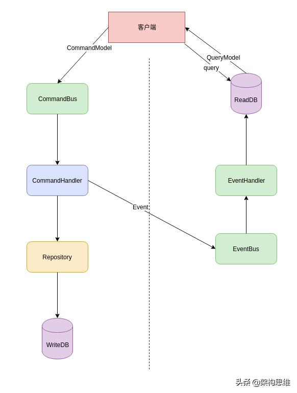

# What Is CQRS?
## 背景
### 分层架构的「原罪」
```md
分层架构虽然将系统按层进行划分，但是层与层之间还是需要进行交互的。交互就需要有接口或协议以及传输的数据。
对于外部调用，我们可以使用TCP、HTTP、RPC、WebService等方式来进行通信；
而对于内部交互来说，我们可以直接使用方法调用，使用接口来进行解耦。
```
* 但是传输的数据结构该如何定呢？
```md
1. 第一种方式是直接使用基础数据结构，比如Map？这有几个问题：
    没有代码提示，包括IDE层面的提示以及业务层面的字段提示，手误的几率较大。将编译期的错误延后到了运行期，降低了开发效率
    没有较完备的基础设施，例如基于注解的字段校验
    性能相对对象会差一点
2. 第二种方式是使用一个对象进行传递，例如ActiveRecord或者直接使用Model。
    但是这会使各层强耦合，使得分层架构的优势消失。由于每层的进化速度不同：持久层相对比较稳定；
    逻辑层可能需要根据业务逻辑的不同而进行调整，例如打折策略；
    而展示层可能需要过一段时间调整，避免审美疲劳。其中一层对传输对象的调整都可能导致其它层跟着一起修改。
3. 第三种方式就是使用各种传输对象
    各层之间的数据传输使用独立的传输对象，使得各层松耦合。
    但是增加了各种传输对象以及转换代码。同时转换也消耗了部分性能。
```
```md
各层的独立进化，导致了交互的额外操作！这就是分层架构的「原罪」！也是需要这么多传输对象的其中一个原因！
而另外一个原因是表现力差异！
```
### [再谈表现力](https://www.toutiao.com/i6705742167073096199/)
```md
在领域设计：聚合与聚合根聊到了表现力问题，「数据设计」的表现力要弱于「对象设计」！相对应的，
其实「数据展现」的表现力也是弱于「对象设计」的！
```
```md
以订单来举例！假设我下单购买了多个商品，也就是说一个订单包含了多个明细。
那么订单与订单明细的这层关系在「持久层」是通过主键来表现

订单明细包含了订单的主键，表示哪些订单明细是属于哪个订单的。
而这层关系在「逻辑层」是通过对象引用来表现的，订单对象中持有了指向订单明细列表的引用。

到了「展示层」，订单和订单详情之间的关系就完全靠展示方式来表现。
```
```md
当我们访问页面的时候，请求从「持久层」将扁平的数据查询到了「逻辑层」，
组装成了结构化的对象，最后被传递到了「展现层」，又被拍扁了展示在我们面前。
由于每层表现形式的不同，亦导致了需要数据传输对象。
```
```md
CQRS通过对系统进行纵向切分：将「数据读」和「数据写」分离开，使得数据读写独立进化，来解决数据显示复杂性问题。
```
## 从横切到纵切

### 流程
```md
1. 客户端构建命令对象CommandModel发送给服务端
2. 服务端通过命令总线CommandBus接收到命令，委托给对应的CommandHandler去处理
3. CommandHandler处理完业务，将此命令通过Repository进行持久化（不一定是DB)
4. 同时会构建一个对应的事件Event，添加到事件总线EventBus中（该事件可以是同步事件、也可以是异步事件）
5. 对应的EventHandler会对该事件进行处理，比如处理成便于展示的模型，存储到ReadDB中
6. 客户端可以对服务端发送查询，服务端直接从ReadDB中获取数据，构建QueryModel返回
```
### 优势
```md
1. 首先，现在只需要CommandModel和QueryModel两个数据传输对象，不再需要那么多的中间传输对象了。
    也就是说，省略了这部分的代码和性能损耗。
2. 其次，读写分离，可以对读写进行专门的优化。
3. 最后，就是可以事件溯源EventSourcing。
```
```md
对于普通分层架构来说，在保存订单时需要一个DTO用于存储相关信息，然后转成多个对应的Model来进行持久化；
而查询订单的时候，你需要查询出多个Model，然后组装成另一个DTO来存储查询的信息，
因为展示的时候可能要展示更多的信息，比如买家和卖家相关信息。
```
```md
同时由于数据都存储在数据库中，且表结构与Model是对应的，你能做的优化就是数据库相关的优化手段。
```
```md
而在CQRS中，数据库被分成了读库和写库。
那存在读库中的数据结构就可以完全按照展示逻辑来优化，比如：我可以有一张订单展示表，表中包含了买家信息和卖家信息。
在展示时，直接查询这张表就可以了，不需要和用户表进行关联查询，提高了数据读性能。
```
```md
而对于数据持久化来说，就不需要考虑数据展示了，只要提高持久化性能就可以了。
例如不使用数据库，而使用顺序写入的文件方式。
同时也不一定要存储数据本身，转而存储事件，就可以实现事件重演，这就是事件溯源。
```
## [事件溯源](https://www.toutiao.com/i6705742167073096199/)
```md
事件溯源存储的不是数据「快照」，而是「事件本身」！即它记录了所有对该数据的事件。
如果你了解Redis的持久化方案，你对事件溯源就一定不会感到陌生。
```
```md
Redis有两种持久化方式RDB方式和AOF方式：
RDB：在指定的时间间隔内，执行指定次数的写操作，则会将内存中的数据写入到磁盘中。对当前数据快照进行持久化
AOF：将指令追加到文件末尾。通过指令重演来恢复数据

我们一般的持久化方式实际对应的就是Redis的RDB方式，而事件溯源就是AOF方式。
```
```md
在CQRS中，WriteDB可以通过类AOF的方式来存储命令，也就是事件溯源。
当需要对ReadDB中的数据进行恢复操作时，可以通过命令重演的方式来恢复。
```
```md
不过你应该发现问题了，命令重演的方式性能上有问题。所以我们可以参考Redis，使用快照+事件溯源的方式来存储。
即WriteDB中存储事件，额外再定时对数据进行快照备份。
恢复数据时先通过快照备份恢复，再从指定位置进行命令重演，来提高性能。
```
## 强一致性or最终一致性
```md
读写分离后，导致的一个问题就是读写一致性。
在原来的分层架构中，数据写入后再读取，是可以立即读取到写入的数据的（事务保障）
```
```md
但是读写分离后，读到的数据不一定是写入的最新数据。
一般情况下，这个问题并不大。因为实际上你读的基本上都是历史数据！为什么这么说呢？
因为你没法保证数据在展现到你面前的过程中，没有新的写入。除非展示是基于推送机制的。
```
```md
但是对于特殊情况下，可能不能容忍这样的情况。有几种解决方案
1. 临时性的显示先前提交给命令模型的参数
2. 在页面展示查询模型的时间
3. 使用类似Comet这样的长链接的方式或者事件模式来监听数据
```