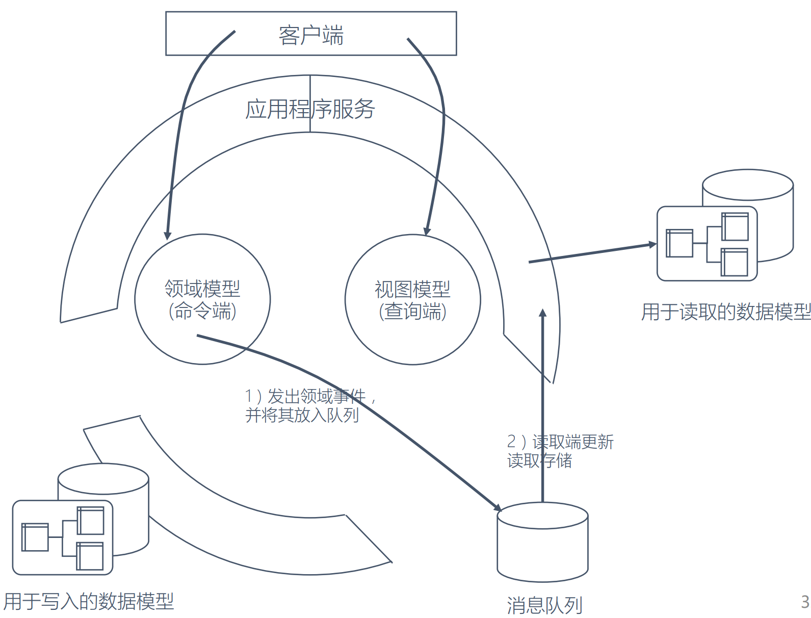

# CQRS (Command and Query Responsibility Segregation)



```text
命令和查询责任分离（Command and Query Responsibility Segregation）

核心概念
	应用程序具有必须完全分离的读取操作和写入操作
	意味着用于写操作（命令）的模型将与读模型（查询）不同
		此外，数据将存储在不同的位置
	在关系数据库中
		这意味着将有用于命令模型的表格和用于读取模型的表格
		一些实现甚至将不同模型存储在完全不同的数据库中
			例如命令模型的SQL Server和读取模型的MongoDB。
实现
	这种模式通常与事件采购相结合
	当用户执行操作时
		应用程序会向命令服务发送命令
		命令服务从命令数据库中检索它需要的所有数据
			进行必要的操作并将其存储回数据库中
		然后它通知读取服务，以便可以更新读取模型
	当应用程序需要向用户显示数据时
		它可以通过调用读取服务来检索读取的模型
优点
	命令模型可以专注于业务逻辑和验证，而读取模型可以针对特定场景量身定制
	您可以避免复杂的查询（例如，SQL中的连接），这使得读取更加高效
缺点
	保持命令和读取模型同步可能会变得复杂
场景
	期望大量读取的应用程序
	复杂域的应用程序
```
```text
将更复杂的领域模型拆分为读取和写入两部分。
将消息传递，数据日志同步，领域事件和事件溯源使用到特定上下文。
```
```text
DDD中有工厂和仓库来管理领域模型，前者主要用于创建，而后者则用于存储。
	这就表明在DDD中是默认将读写分离的，DDD似乎就天生和CQRS有着无缝的链接。
让DDD和CQRS结合，我们可以分别对读和写建模
	查询模型通常是一种非规范化数据模型，它并不反映领域行为，只是用于数据显示
	命令模型执行领域行为，且在领域行为执行完成后，想办法通知到查询模型。
```
```md
CQRS就是对事务脚本和领域模型两种模式的综合
因为对于Query和报表的场景，使用领域模型往往会把简单的事情弄复杂，
此时完全可以用奥卡姆剃刀把领域层剃掉，直接访问Infrastructure。
```
# [WhatIs](WhatIs.md)
