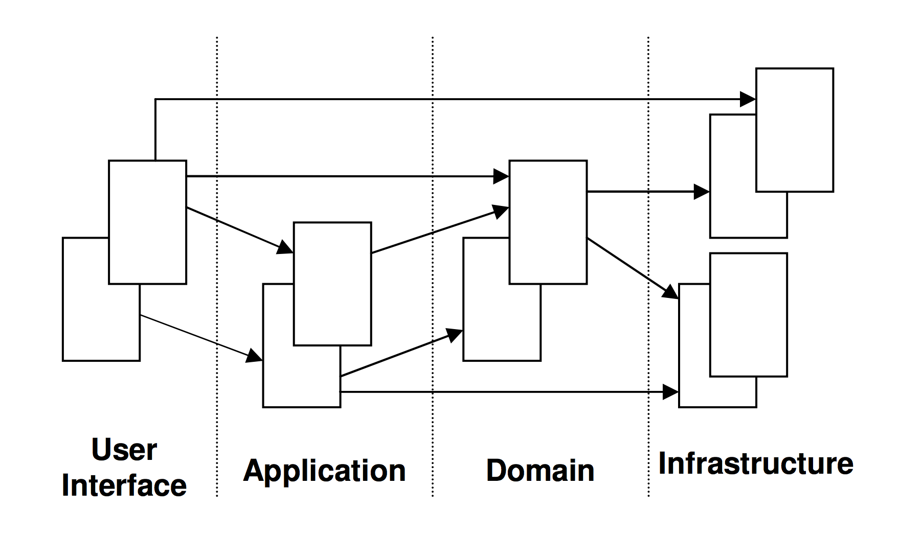

# 分层架构

业务与技术关注点分离，依赖倒置，内部不依赖于外部且外部可替换
接口适配器架构
防腐层建设，领域模型依赖稳定性

## User Interface
负责向用户展现信息，并且会解析用户行为，即常说的展现层。

## Application Layer
应用层没有任何的业务逻辑代码，它很简单，它主要为程序提供任务处理。

## Domain Layer
这一层包含有关领域的信息，是业务的核心，领域模型的状态都直接或间接（持久化至数据库）存储在这一层。

## Infrastructure Layer
为其他层提供底层依赖操作。

