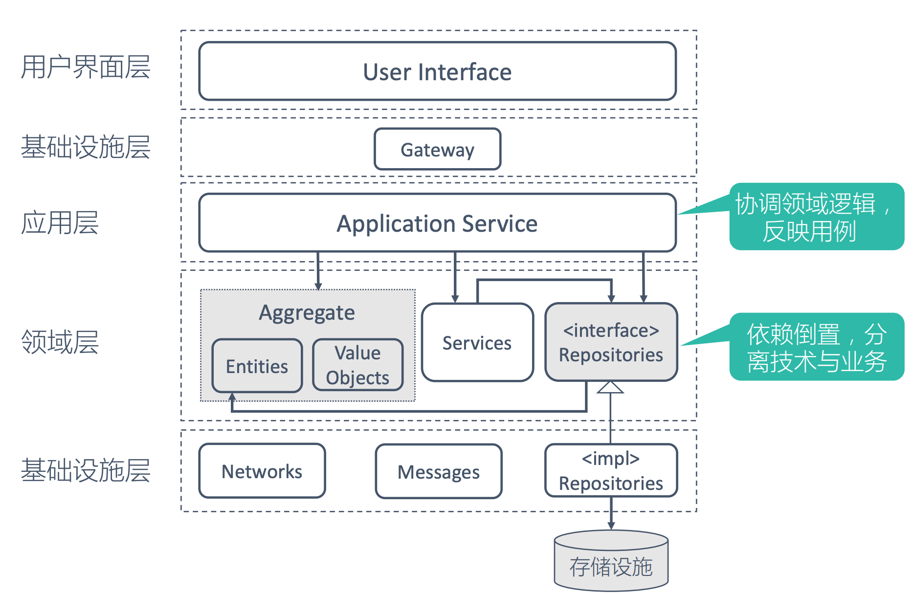
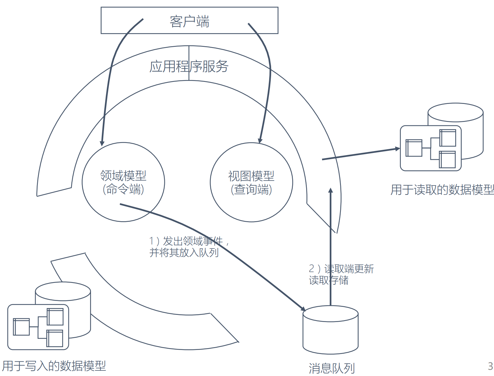

# DDD 的架构风格
* 分层设计

```md
业务与技术关注点分离，依赖倒置，内部不依赖于外部且外部可替换
接口适配器架构
防腐层建设，领域模型依赖稳定性
```
* CQRS

```md
将更复杂的领域模型拆分为读取和写入两部分。
将消息传递，数据日志同步，领域事件和事件溯源使用到特定上下文。
```
```md
DDD中有工厂和仓库来管理领域模型，前者主要用于创建，而后者则用于存储。
	这就表明在DDD中是默认将读写分离的，DDD似乎就天生和CQRS有着无缝的链接。
让DDD和CQRS结合，我们可以分别对读和写建模
	查询模型通常是一种非规范化数据模型，它并不反映领域行为，只是用于数据显示
	命令模型执行领域行为，且在领域行为执行完成后，想办法通知到查询模型。
```
* 六边形架构

```md
在DDD的设计思想下，六边形架构风格，让领域模型处于架构的核心区域，让开发人员将焦点聚集到领域。
DDD和六边形架构是天然契合的，是DDD的首选架构。
```
```md
架构目标：
独立于框架
与数据库分离
可测试性
与外部结构分离
与UI分离

架构原则：
关注点分离，切割不同层
依赖原则：外部依赖内部，依赖倒置
架构设计围绕用例
```
* REST架构
* 事件驱动

## Reference
* [领域驱动设计实践 —— 架构风格及架构实例](https://blog.csdn.net/lx520aa/article/details/77936802)
