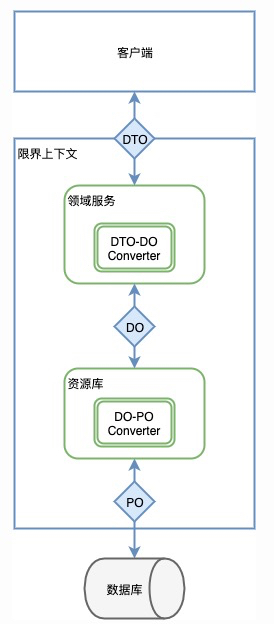

# [美团-抽奖-工程实现](https://tech.meituan.com/2017/12/22/ddd-in-practice.html)
## 模块
```md
在我们的工程中，一般尽量用一个模块来表示一个领域的限界上下文。
如代码中所示，一般的工程中包的组织方式为{com.公司名.组织架构.业务.上下文.*}，
这样的组织结构能够明确的将一个上下文限定在包的内部。
```
```java
import com.company.team.bussiness.lottery.*;//抽奖上下文
import com.company.team.bussiness.riskcontrol.*;//风控上下文
import com.company.team.bussiness.counter.*;//计数上下文
import com.company.team.bussiness.condition.*;//活动准入上下文
import com.company.team.bussiness.stock.*;//库存上下文
```
```md
对于模块内的组织结构，一般情况下我们是按照领域对象、领域服务、领域资源库、防腐层等组织方式定义的。
```
```md
import com.company.team.bussiness.lottery.domain.valobj.*;//领域对象-值对象
import com.company.team.bussiness.lottery.domain.entity.*;//领域对象-实体
import com.company.team.bussiness.lottery.domain.aggregate.*;//领域对象-聚合根
import com.company.team.bussiness.lottery.service.*;//领域服务
import com.company.team.bussiness.lottery.repo.*;//领域资源库
import com.company.team.bussiness.lottery.facade.*;//领域防腐层
```
## 领域对象
```md
领域驱动要解决的一个重要的问题，就是解决对象的贫血问题。
这里我们用之前定义的抽奖（DrawLottery）聚合根和奖池（AwardPool）值对象来具体说明。

抽奖聚合根持有了抽奖活动的id和该活动下的所有可用奖池列表，
它的一个最主要的领域功能就是根据一个抽奖发生场景（DrawLotteryContext），选择出一个适配的奖池，即chooseAwardPool方法。

chooseAwardPool的逻辑是这样的：
DrawLotteryContext会带有用户抽奖时的场景信息（抽奖得分或抽奖时所在的城市），
DrawLottery会根据这个场景信息，匹配一个可以给用户发奖的AwardPool。
```
```java
package com.company.team.bussiness.lottery.domain.aggregate;
import ...;
  
public class DrawLottery {
    private int lotteryId; //抽奖id
    private List<AwardPool> awardPools; //奖池列表
  
    //getter & setter
    public void setLotteryId(int lotteryId) {
        if(id<=0){
            throw new IllegalArgumentException("非法的抽奖id"); 
        }
        this.lotteryId = lotteryId;
    }
  
    //根据抽奖入参context选择奖池
    public AwardPool chooseAwardPool(DrawLotteryContext context) {
        if(context.getMtCityInfo()!=null) {
            return chooseAwardPoolByCityInfo(awardPools, context.getMtCityInfo());
        } else {
            return chooseAwardPoolByScore(awardPools, context.getGameScore());
        }
    }
     
    //根据抽奖所在城市选择奖池
    private AwardPool chooseAwardPoolByCityInfo(List<AwardPool> awardPools, MtCifyInfo cityInfo) {
        for(AwardPool awardPool: awardPools) {
            if(awardPool.matchedCity(cityInfo.getCityId())) {
                return awardPool;
            }
        }
        return null;
    }
  
    //根据抽奖活动得分选择奖池
    private AwardPool chooseAwardPoolByScore(List<AwardPool> awardPools, int gameScore) {...}
}
```
```md
在匹配到一个具体的奖池之后，需要确定最后给用户的奖品是什么。这部分的领域功能在AwardPool内。
```
```java
package com.company.team.bussiness.lottery.domain.valobj;
import ...;
  
public class AwardPool {
    private String cityIds;//奖池支持的城市
    private String scores;//奖池支持的得分
    private int userGroupType;//奖池匹配的用户类型
    private List<Award> awards;//奖池中包含的奖品
  
    //当前奖池是否与城市匹配
    public boolean matchedCity(int cityId) {...}
  
    //当前奖池是否与用户得分匹配
    public boolean matchedScore(int score) {...}
  
    //根据概率选择奖品
    public Award randomGetAward() {
        int sumOfProbability = 0;
        for(Award award: awards) {
            sumOfProbability += award.getAwardProbability();
        }
        int randomNumber = ThreadLocalRandom.current().nextInt(sumOfProbability);
        range = 0;
        for(Award award: awards) {
            range += award.getProbability();
            if(randomNumber<range) {
                return award;
            }
        }
        return null;
    }
}
```
```md
与以往的仅有getter、setter的业务对象不同，领域对象具有了行为，对象更加丰满。
同时，比起将这些逻辑写在服务内（例如**Service），领域功能的内聚性更强，职责更加明确。
```
## 资源库
```md
领域对象需要资源存储，存储的手段可以是多样化的，常见的无非是数据库，分布式缓存，本地缓存等。
资源库（Repository）的作用，就是对领域的存储和访问进行统一管理的对象。
在抽奖平台中，我们是通过如下的方式组织资源库的。
```
```java
//数据库资源
import com.company.team.bussiness.lottery.repo.dao.AwardPoolDao;//数据库访问对象-奖池
import com.company.team.bussiness.lottery.repo.dao.AwardDao;//数据库访问对象-奖品
import com.company.team.bussiness.lottery.repo.dao.po.AwardPO;//数据库持久化对象-奖品
import com.company.team.bussiness.lottery.repo.dao.po.AwardPoolPO;//数据库持久化对象-奖池
  
import com.company.team.bussiness.lottery.repo.cache.DrawLotteryCacheAccessObj;//分布式缓存访问对象-抽奖缓存访问
import com.company.team.bussiness.lottery.repo.repository.DrawLotteryRepository;//资源库访问对象-抽奖资源库
```
```md
资源库对外的整体访问由Repository提供，它聚合了各个资源库的数据信息，同时也承担了资源存储的逻辑（例如缓存更新机制等）。

在抽奖资源库中，我们屏蔽了对底层奖池和奖品的直接访问，而是仅对抽奖的聚合根进行资源管理。
代码示例中展示了抽奖资源获取的方法（最常见的Cache Aside Pattern）。

比起以往将资源管理放在服务中的做法，由资源库对资源进行管理，职责更加明确，代码的可读性和可维护性也更强。
```
```java
package com.company.team.bussiness.lottery.repo;
import ...;
  
@Repository
public class DrawLotteryRepository {
    @Autowired
    private AwardDao awardDao;
    @Autowired
    private AwardPoolDao awardPoolDao;
    @AutoWired
    private DrawLotteryCacheAccessObj drawLotteryCacheAccessObj;
  
    public DrawLottery getDrawLotteryById(int lotteryId) {
        DrawLottery drawLottery = drawLotteryCacheAccessObj.get(lotteryId);
        if(drawLottery!=null){
            return drawLottery;
        }
        drawLottery = getDrawLotteyFromDB(lotteryId);
        drawLotteryCacheAccessObj.add(lotteryId, drawLottery);
        return drawLottery;
    }
  
    private DrawLottery getDrawLotteryFromDB(int lotteryId) {...}
}
```
## 防腐层
```md
亦称适配层。在一个上下文中，有时需要对外部上下文进行访问，通常会引入防腐层的概念来对外部上下文的访问进行一次转义。
```
```md
有以下几种情况会考虑引入防腐层：
需要将外部上下文中的模型翻译成本上下文理解的模型。
不同上下文之间的团队协作关系，如果是供奉者关系，建议引入防腐层，避免外部上下文变化对本上下文的侵蚀。
该访问本上下文使用广泛，为了避免改动影响范围过大。
```
```md
如果内部多个上下文对外部上下文需要访问，那么可以考虑将其放到通用上下文中。
```
```md
在抽奖平台中，我们定义了用户城市信息防腐层(UserCityInfoFacade)，
用于外部的用户城市信息上下文（微服务架构下表现为用户城市信息服务）。

以用户信息防腐层举例，它以抽奖请求参数(LotteryContext)为入参，以城市信息(MtCityInfo)为输出。
```
```java
package com.company.team.bussiness.lottery.facade;
import ...;
  
@Component
public class UserCityInfoFacade {
    @Autowired
    private LbsService lbsService;//外部用户城市信息RPC服务
     
    public MtCityInfo getMtCityInfo(LotteryContext context) {
        LbsReq lbsReq = new LbsReq();
        lbsReq.setLat(context.getLat());
        lbsReq.setLng(context.getLng());
        LbsResponse resp = lbsService.getLbsCityInfo(lbsReq);
        return buildMtCifyInfo(resp);
    }
  
    private MtCityInfo buildMtCityInfo(LbsResponse resp) {...}
}
```
## 领域服务
```md
上文中，我们将领域行为封装到领域对象中，将资源管理行为封装到资源库中，将外部上下文的交互行为封装到防腐层中。
此时，我们再回过头来看领域服务时，能够发现领域服务本身所承载的职责也就更加清晰了，
即就是通过串联领域对象、资源库和防腐层等一系列领域内的对象的行为，对其他上下文提供交互的接口。
```
```md
我们以抽奖服务为例（issueLottery），可以看到在省略了一些防御性逻辑（异常处理，空值判断等）后，领域服务的逻辑已经足够清晰明了。
```
```java
package com.company.team.bussiness.lottery.service.impl
import ...;
  
@Service
public class LotteryServiceImpl implements LotteryService {
    @Autowired
    private DrawLotteryRepository drawLotteryRepo;
    @Autowired
    private UserCityInfoFacade UserCityInfoFacade;
    @Autowired
    private AwardSendService awardSendService;
    @Autowired
    private AwardCounterFacade awardCounterFacade;
  
    @Override
    public IssueResponse issueLottery(LotteryContext lotteryContext) {
        DrawLottery drawLottery = drawLotteryRepo.getDrawLotteryById(lotteryContext.getLotteryId());//获取抽奖配置聚合根
        awardCounterFacade.incrTryCount(lotteryContext);//增加抽奖计数信息
        AwardPool awardPool = lotteryConfig.chooseAwardPool(bulidDrawLotteryContext(drawLottery, lotteryContext));//选中奖池
        Award award = awardPool.randomChooseAward();//选中奖品
        return buildIssueResponse(awardSendService.sendAward(award, lotteryContext));//发出奖品实体
    }
  
    private IssueResponse buildIssueResponse(AwardSendResponse awardSendResponse) {...}
}
```
## 数据流转

```md
 首先领域的开放服务通过信息传输对象（DTO）来完成与外界的数据交互；
 在领域内部，我们通过领域对象（DO）作为领域内部的数据和行为载体；
 在资源库内部，我们沿袭了原有的数据库持久化对象（PO）进行数据库资源的交互。
 同时，DTO与DO的转换发生在领域服务内，DO与PO的转换发生在资源库内。
```
```md
与以往的业务服务相比，当前的编码规范可能多造成了一次数据转换，但每种数据对象职责明确，数据流转更加清晰。
```
## 上下文集成
```md
通常集成上下文的手段有多种，常见的手段包括开放领域服务接口、开放HTTP服务以及消息发布-订阅机制。
```
```md
在抽奖系统中，我们使用的是开放服务接口进行交互的。
最明显的体现是计数上下文，它作为一个通用上下文，对抽奖、风控、活动准入等上下文都提供了访问接口。 
同时，如果在一个上下文对另一个上下文进行集成时，若需要一定的隔离和适配，可以引入防腐层的概念。
这一部分的示例可以参考前文的防腐层代码示例。
```