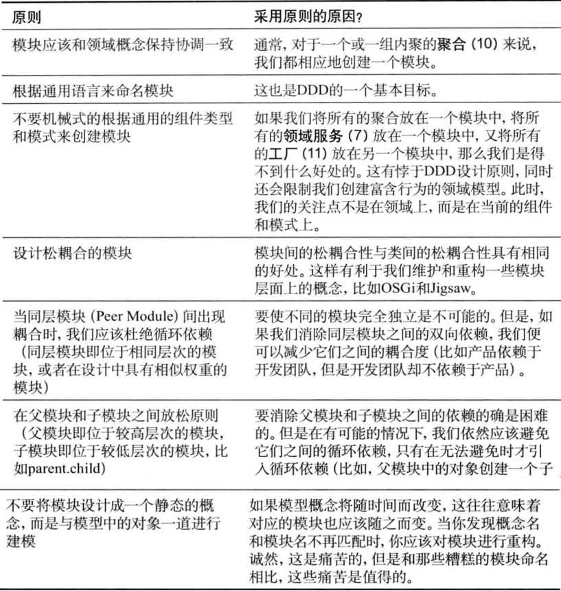

# 模块

对于一个复杂的应用来说，领域模型将会变的越来越大，以至于很难去描述和理解，更别提模型之间的关系了。
模块的出现，就是为了组织统一的模型概念来达到减少复杂性的目的的。
另一个原因则是模块可以提高代码质量和可维护性，比如我们常说的高内聚，低耦合就是要提倡将相关的类内聚在一起实现模块化。

在DDD中，模块表示了一个命名的容器，用于存放领域中内聚在一起的类。
模块（Module）是DDD中明确提到的一种控制限界上下文的手段，推荐在工程中，一般尽量用一个模块来表示一个领域的限界上下文。

模块应该包含一組具有高内聚性的概念集合，这样做的好处是可以在不同的模块之间实现松耦合。
否则，我们应该修改模型以重新划分这些概念。
……由于模块名是UL的一部分，模块名应该反映出它们在领域中的概念。[Evans]

模块的设计是基于领域模型的，要符合通用语言的表述。
其次，模块的设计要符合高内聚低耦合的设计思想。

## 模块交互
模块应当有对外的统一接口供其他模块调用，
比如有三个对象在模块a中，那么模块b不应该直接操作这三个对象，而是操作暴露的接口。
模块的命名也很有讲究，最好能够深层次反映领域模型。

## 模块设计原则

## 模块和限界上下文的关系
模块与子域和限界上下文并不是一致的概念，模块也是一种独立的建模方法。
对于何时应该对领域模型进行分离，何时将领域模型建模成一个整体，应该仔细地思考与对待。

有时通用语言可以很好地帮助我们做出正确的选择。但是另外的时候，其中的术语将变得非常含糊。
在这种情况下,我们并不清楚如何划分上下文边界。
此时,我们可以首先将它们放在一起，使用模块来对模型进行划分，面不是限界上下文。

但是，这并不意味着我们就应该限制对限界上下文的创建。
我们应该通过通用语言的需求来划分模型边界。
但限界上下文不是用来代替模块的。

使用摸块的目的在于组织那些内聚在一起的领域对象，
对于那些内聚性不强或者没有内聚性的领域对象来说，我们应该将它们划分在不同的模块中。
