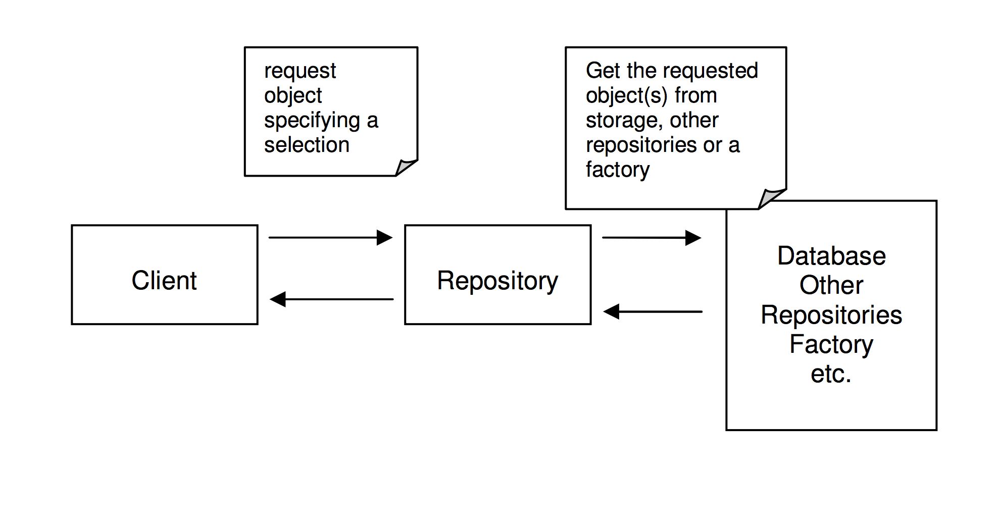

# 库(Repository)

仓库封装了获取对象的逻辑，领域对象无须和底层数据库交互，它只需要从仓库中获取对象即可。

仓库可以存储对象的引用，当一个对象被创建后，它可能会被存储到仓库中，那么下次就可以从仓库取。
如果用户请求的数据没在仓库中，则会从数据库里取，这就减少了底层交互的次数。

当然，仓库获取对象也是有策略的，如下：

## 获取对象策略

仓库看起来有些像Infrastructure Layer的东西，但其实不然，仓库更像是本地缓存，需要时才会访问数据库。
