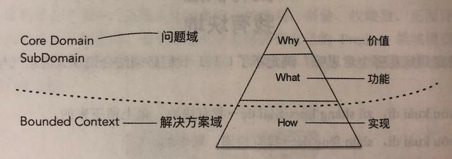

# 领域驱动设计过程
## 设计领域模型的一般步骤
```md
1. 根据需求划分出初步的领域和限界上下文，以及上下文之间的关系；
2. 进一步分析每个上下文内部，识别出哪些是实体，哪些是值对象；
3. 对实体、值对象进行关联和聚合，划分出聚合的范畴和聚合根；
4. 为聚合根设计仓储，并思考实体或值对象的创建方式；
5. 在工程中实践领域模型，并在实践中检验模型的合理性，倒推模型中不足的地方并重构。
```
## 战略设计
```md
战略和战术设计是站在DDD的角度进行划分。
战略设计侧重于高层次、宏观上去划分和集成限界上下文，而战术设计则关注更具体使用建模工具来细化上下文。
```
```md
1. 问题域方面
    引入核心领域/子领域来划分问题域，然后通过限界上下文和上下文映射给出这些问题域的解决方案
2. 架构方面
    通过分层架构来隔离关注点，引入六边形架构表述领域与技术基础设施的边界，CQRS模式分离查询场景和命令场景。
```
## 战术设计
```md
领域驱动设计围绕领域模型进行设计，通过分层架构将领域独立出来。
表示领域模型的对象包括实体、值对象、领域服务和领域事件。领域逻辑应该封装在这些对象中。
聚合代表的是边界概念，而非领域概念。
工厂和资源库都是对领域对象生命周期的管理。
```
```md
战略设计会控制和分解战术设计的边界与粒度，战术设计则以实证角度验证领域模型的有效性、完整性和一致性，
进而以演进的方式对之前的战略设计进行迭代，从而形成一个中螺旋上升的设计迭代过程。
```
```md
经过需求获得清晰的问题域，通过对问题域进行分析和建模，识别限界上下文，划分相对独立的领域，通过上下文映射建立它们之间的关系，
辅以分层架构和六边形架构划分系统的逻辑边界和物理边界，界定领
```
```md
之后，进入战术设计阶段，深入限界上下文内对领域进行建模，并以领域模型指导程序设计与编码实现。
在实现过程中，若发现领域模型存在重复、错位或丢失，就需要对模型进行重构，甚至重新划分限界上下文。
```
## 问题域与解决方案域
```md
领域驱动设计其实就是从问题域到解决方案域的过程。
问题域属于需求阶段，重点是明确这个系统要解决什么问题，能够提供什么价值，也就是关注系统的What和why。
解决问题域属于系统设计解决，针对识别出来的问题域，寻求合理的解决方案，也就是关注系统的How。
在领域驱动设计中，核心领域和子领域属于问题域范畴，限界上下文属于解决方案域范畴。
```

```md
核心领域/子领域和限界上下文之间并没有所谓的映射关系，前者关注系统的价值和功能，因而对它们的识别，只限于从业务上对他们的分解。
对于核心领域，我们应付出更多的开发成本，组建更好的团队为其建立稳定正确的领域模型。
至于子领域，就可以降低设计与开发要求，甚至可以引入外包或购买其通用功能的组件和服务。
```
```md
从问题域到解决问题方案域，实际上就是从需求分析到设计的过程。
限界上下文是解决方案域的架构基石。
```