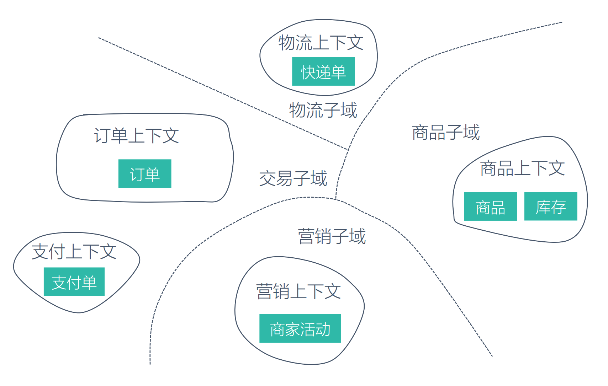
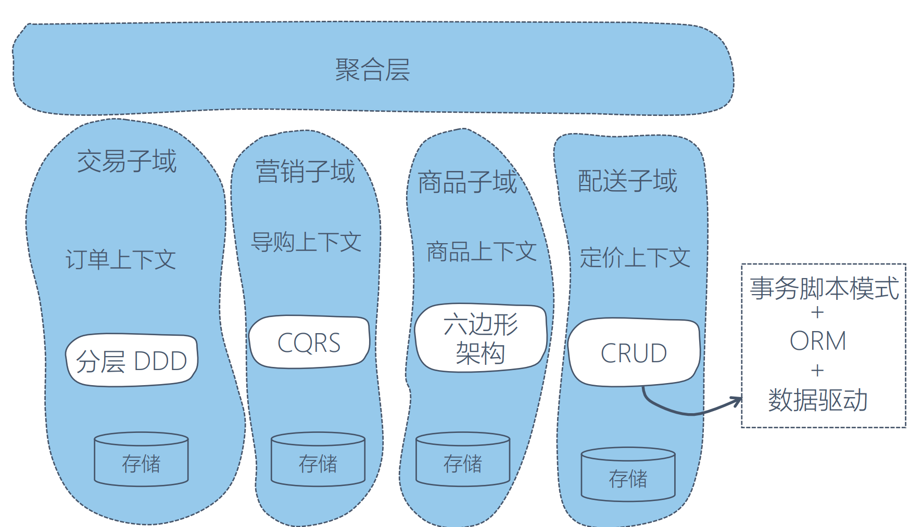

# 事件风暴-领域分析
* 流程：
```md
PM，运营，RD共聚一堂
数小时内理解复杂领域
标记简单的UML
工作流程与DDD完美匹配
事件流演化
```
## 以电商系统为例
* 事件风暴
```md
事件：PM关心真实事件
如：用户订单已发布，商品已发布
说明：关注点在于什么领域模型发生了什么变化。
```
* 命令风暴
```md
命令：通过什么活动产生了事件
如：用户提交了订单，开放平台同步商品
说明：命令帮助我们明确系统对外提供的能力，同时明确业务上的输入
命令来源：用户UI界面的操作，外部系统调用触发，定时任务触发
```
* 寻找聚合
```md
聚合：一组相关性领域模型的聚合，用来封装业务不变性，确保关联紧密的领域模型内聚在一起
如：订单和商品
聚合的目的在于业务内聚，强迫RD进行简化领域模型的关联，实现业务设计高内聚低耦合的目的
```
* 划分界限上下文
```md
业务模型的问题是否同一个，是则放在同一个界限上下文中
如果一个聚合同时解决了多个问题，则需要定义不同的上下文确定解决特定问题
```

```md
界限上下文之内可以自由选择架构模式，如MVC，CQRS，微服务，SOA等。
不是所有界限上下文都采用领域驱动方式，非核心子域可参考数据驱动下的面向过程编程。
提取出面向切面的聚合层，以工程技术因素为主要考虑点。
DDD的核心价值在于指导划分界限上下文。
```

