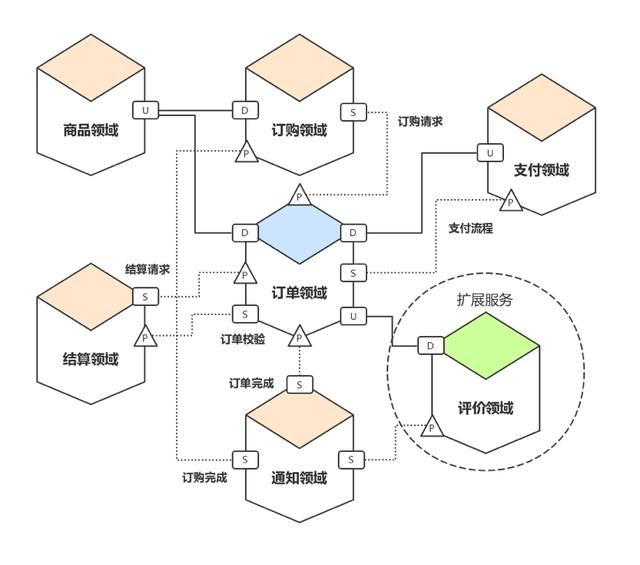

# DDD 建模

## [领域模型](DomainModel.md)

## DDD建模方法
*  [事件风暴-领域分析](DomainAnalysis/EventStorming-Analysis.md)

## [设计过程](Design.md)
## [建模过程](Modeling.md)

## 实践
* 交易系统的领域边界图

```md
不同颜色表明不同领域，U/D 代表上游和下游。
这个图还不算完整，因为领域业务逻辑是要为端服务的，而通过对领域的梳理，可以通用的支持很多端。
即表达为领域有界，端无界。最终，每个限界上下文即是微服务。
```
* [马蜂窝优惠中心重构](https://blog.csdn.net/weixin_43846997/article/details/95559774)
* [社区服务系统（ECO）中基于SpringMVC+MyBatis框架对DDD的落地实现](https://www.cnblogs.com/daoqidelv/p/7492322.html)
* [DDD实战进阶第一波 开发一般业务的大健康行业直销系统](https://blog.csdn.net/malaoko1000?t=1)

