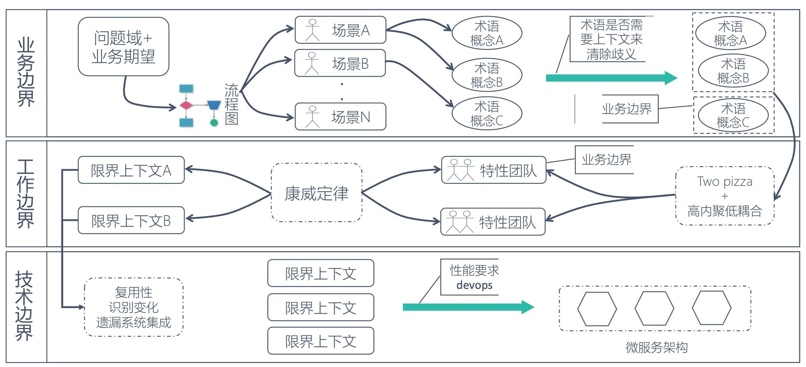

# Bounded Context
```md
Eric Evans 用细胞来形容限界上下文，因为细胞之所以能够存在，
是因为细胞限定了什么在细胞内，什么在细胞外，并且确定了什么物质可以通过细胞膜。
这里的细胞代表了上下文，而细胞膜带包了包裹上下文的边界。
```
```md
分析限界上下文的本质，就是对边界的控制。由显示边界限定的特定内聚职责，领域模型便存在于上下文之内。
在边界内，每一个模型概念，包括它的属性和操作，都具有特殊的含义。
```
```md
一个给定的业务领域会包含多个限界上下文，想与一个限界上下文沟通，则需要通过显示边界进行通信。
系统通过确定的限界上下文来进行解耦，而每一个上下文内部紧密组织，职责明确，具有较高的内聚性。
```
```md
一个很形象的隐喻：细胞质所以能够存在，是因为细胞膜限定了什么在细胞内，什么在细胞外，并且确定了什么物质可以通过细胞膜。
```
```md
领域逻辑层面：确定了领域模型的业务边界
团队合作层面：确定了开发团队的工作边界
技术实现层面：确定了系统架构的应用边界
```

## 划分限界上下文
* 界限上下文识别过程


* 实践
```md
考虑产品所讲的通用语言，从中提取一些术语称之为概念对象，寻找对象之间的联系。
或者从需求里提取一些动词，观察动词和对象之间的关系。
我们将紧耦合的各自圈在一起，观察他们内在的联系，从而形成对应的界限上下文。

形成之后，我们可以尝试用语言来描述下界限上下文的职责，看它是否清晰、准确、简洁和完整。
简言之，限界上下文应该从需求出发，按领域划分。
```

## 集成BC（界限上下文）
```md
一个项目中会存在多个BC，业务需要对它们进行集成。有多种直接的方法进行集成。最简单的方式就是一个BC中暴露API，然后在另外一个BC中通过RPC进行调用。
另外我们也可以通过消息机制进行集成，系统通过消息队列或者发布-订阅机制进行通讯。
第三种方式是通过使用RESTful的方式进行集成。当然，还存在有其他的集成方式。
```
