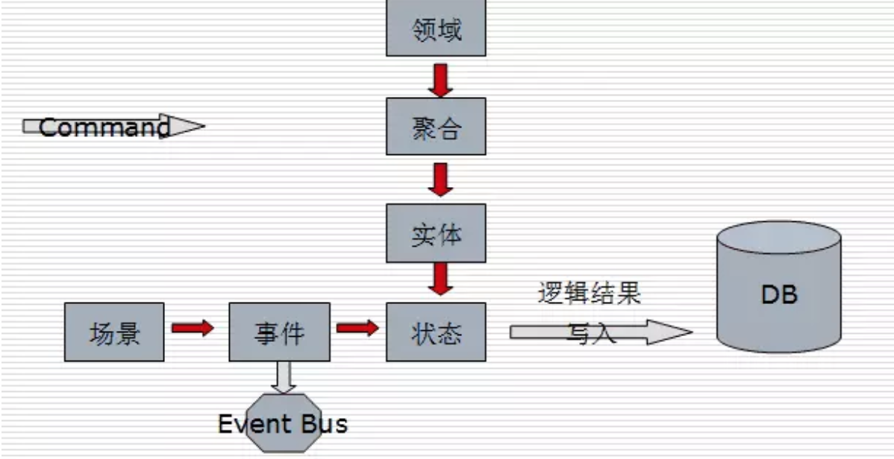

# Domain Event
```md
领域事件是对领域内发生的活动进行的建模。
```
```md
Domain Event是由一个特定领域触因为一个用户Command触发的发生在过去的行为产生的事件，而这个事件是系统中其它部分感兴趣的。
一个领域事件可以理解为是发生在一个特定领域中的事件，是你希望在同一个领域中其他部分知道并产生后续动作的事件。
```
```md
领域专家所关心的发生在领域中的一些事件。
将领域中所发生的活动建模成一系列的离散事件。
每个事件都用领域对象来表示...领域事件是领域模型的组成部分，表示领域中所发生的事情。
```
```md
“重要的事件肯定会在系统其它地方引起反应，因此理解为什么会有这些反应同样也很重要。”
```
```md
当然领域事件并不是DDD所必须的。
```
```md
但是并不是所有发生过的事情都可以成为领域事件。
一个领域事件必须对业务有价值，有助于形成完整的业务闭环，也即一个领域事件将导致进一步的业务操作。
```
```md
领域事件可以是业务流程的一个步骤，
例如订单提交，客户付费100元，订单完工等。
领域事件也可以是定时发生的事情，例如每晚对账完成。
或者是一个事件发生后引发的后续动作，例如客户输错密码三次后发生锁定账户的事件。
```
```md
领域事件也是一种基于事件的架构（EDA）。事件架构的好处可以把处理的流程解耦，实现系统可扩展性，提高主业务流程的内聚性。
```
```md
如果改为事件驱动模式，把订单提交后触发一个事件，在订单保存后，触发订单提交事件。
通知和后续的各种服务动作可以通过订阅这个事件，在自己的实现空间内实现对应的逻辑，
这样就把订单提交和后续其他非主要活动从订单提交业务中剥离，实现了订单提交业务高内聚和低耦合性。
```
* 首先是解决领域的聚合性问题
```md
DDD中的聚合有一个原则是，在单个事务中，只允许对一个聚合对象进行修改，由此产生的其他改变必须在单独的事务中完成。
如果一个业务跨多个聚合对象，领域事件会是一个不错的工具来解决这个问题。
通过领域事件的方式可以达到各个组件之间的数据一致性，通过最终一致性取代事务一致性。
```
* 其次领域事件也是一种领域分析的工具
```md
有时从领域专家的话中，我们看不出领域事件的迹象，但是业务需求依然有可能需要领域事件。
动态流的事件模型加上结合DDD的聚合实体状态和BC，可以有效进行领域建模。
```
* 为什么Domain Event如此重要？
```md
因为在现在的分布式环境下，没有一个业务系统是割裂的，而Messaging绝对是系统之间耦合度最低，最健壮，最容易扩展的一种通信机制。
因此理论上它是分布式系统的必选项。
```
## 实现
```md
领域事件可以通过观察者模式和订阅模式进行实现。比较常见的实现方式是事件总线（Event Bus）。
```

