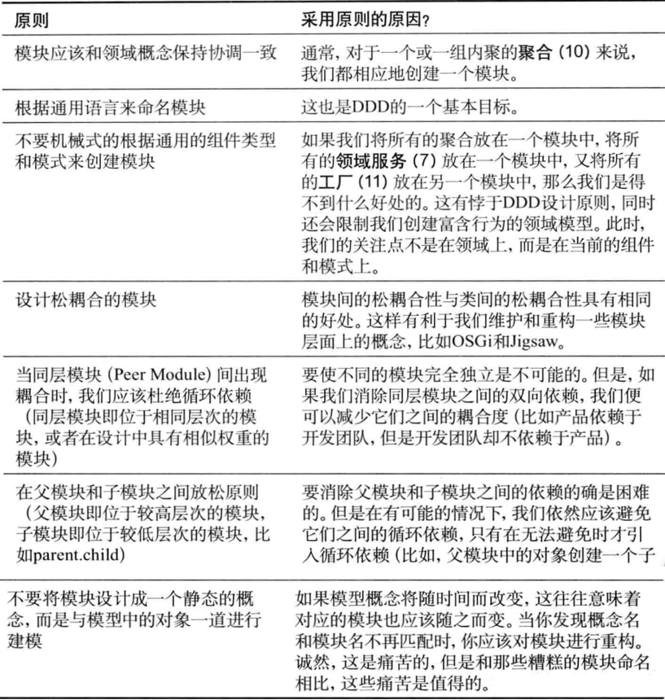

# 模块
```md
在DDD中，模块表示了一个命名的容器，用于存放领域中内聚在一起的类。
模块（Module）是DDD中明确提到的一种控制限界上下文的手段，推荐在工程中，一般尽量用一个模块来表示一个领域的限界上下文。
```
```md
模块应该包含一組具有高内聚性的概念集合，这样做的好处是可以在不同的模块之间实现松耦合。
否则，我们应该修改模型以重新划分这些概念。
……由于模块名是UL的一部分，模块名应该反映出它们在领域中的概念。[Evans]
```
```md
模块的设计是基于领域模型的，要符合通用语言的表述。其次，模块的设计要符合高内聚低耦合的设计思想。
```
## 模块设计原则


## 模块和BC的关系
```md
模块与子域和限界上下文并不是一致的概念，模块也是一种独立的建模方法。
对于何时应该对领域模型进行分离，何时将领域模型建模成一个整体，应该仔细地思考与对待。

有时通用语言可以很好地帮助我们做出正确的选择。但是另外的时候，其中的术语将变得非常含糊。
在这种情况下,我们并不清楚如何划分上下文边界。
此时,我们可以首先将它们放在一起，使用模块来对模型进行划分，面不是限界上下文。
```
```md
但是，这并不意味着我们就应该限制对限界上下文的创建。我们应该通过通用语言的需求来划分模型边界。但限界上下文不是用来代替模块的。
使用摸块的目的在于组织那些内聚在一起的领域对象，对于那些内聚性不强或者没有内聚性的领域对象来说，我们应该将它们划分在不同的模块中。
```
