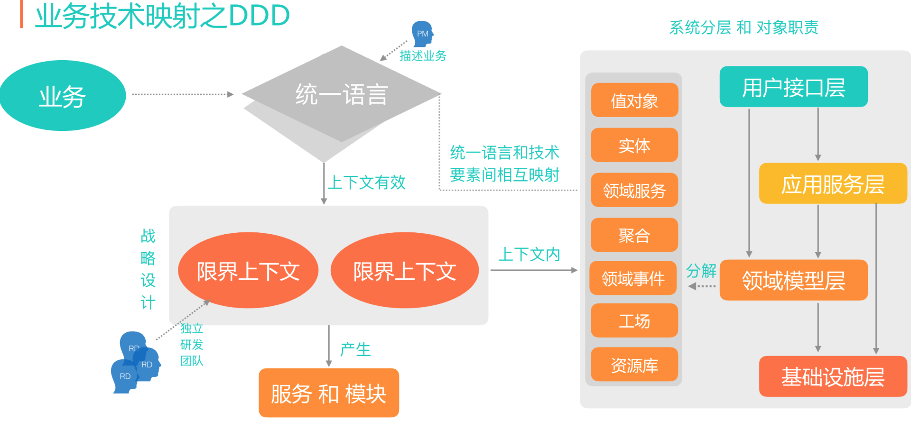

# DDD
## 概念
* 领域
```md
现实世界中，领域包含了问题域和解系统。一般认为软件是对现实世界的部分模拟。
在DDD中，解系统可以映射为一个个限界上下文，限界上下文就是软件对于问题域的一个特定的、有限的解决方案。
```
* [界限上下文(Bounded Context)](BoundedContext.md)

* 业务语义显性化

* 通用语言

* [领域事件(Domain Event)](DomainEvent.md)

* [事件风暴(Event Storming)](EventStorming.md)

* [聚合根(Aggregate Root)](AggregateRoot.md)


* [上下文映射](ContextMap.md)

* [实体&值对象](Entity&ValueObject.md)
* * [领域服务(Domain Service)](DomainEvent.md)

* [模块](Module.md)

* 模型重构

* 业务可视化和可配置化



## DDD模式
* 基于问题空间的DDD模式


* 基于解空间的DDD模式

