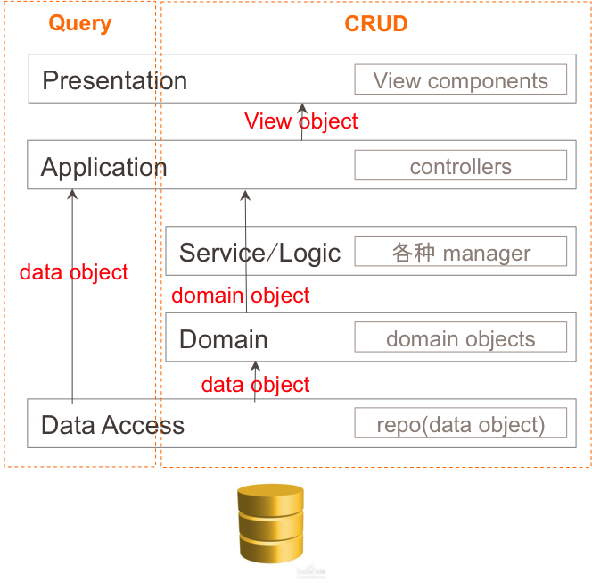

# DDD 
```md
2004年著名建模专家Eric Evans发表了他最具影响力的书籍:
《Domain-Driven Design Tackling Complexity in the Heart of Software》(中文译名：领域驱动设计软件核心复杂性应对之道)
书中提出了领域驱动设计(简称 DDD)的概念。
```
* DDD是面向对象的，是一种知识丰富的设计（Knowledge Rich Design）
```md
通过领域对象（Domain Object），领域语言（Ubiquitous Language）将核心的领域概念通过代码的形式表达出来，从而增加代码的可理解性。
领域核心不仅仅是业务里的“名词”，所有的业务活动和规则如同实体一样，都需要明确的表达出来。
```
* Persistence Ignorance：持久化无关设计
```md
类和表的区别：
【引用】关系数据库表表示多对多的关系是第三张表来实现，这个领域模型表示不具象化，业务同学看不懂
【封装】类可以设计方法，数据并不能完整的表达领域模型，数据表可以知道一个人三维，并不知道“一个人是可以跑的”
【继承，多态】类可以多态，数据上无法识别人与猪除了三维数据还有行为的区别，数据表不知道“一个人跑起来和一头猪跑起来是不一样的”

在这种思路下，数据库回归persistence的本质：
【存】将对象数据持久化到存储介质中
【取】高效的把数据查询返回到内存中

由于不再承载领域建模这个特性，数据库的设计可以变得天马行空，任何可以加速存储和搜索的手段都可以用上，
我们可以用column数据库，可以用document数据库，可以设计非常精巧的中间表去完成大数据的查询。
```


## 目标
```md
领域模型的价值在于提供一种通用的语言，使得领域专家和软件技术人员联系在一起，沟通无歧义。
```
* DDD带来的不同：
```md
将原有以技术角度审视架构演进的视角，转换到以业务视角切入架构。
业务复杂度来源于领域本身，深入领域，正确识别出领域深层次概念及关系。
将领域知识进行结构性表达，同时与编程模型保持一致，便形成了DDD。
```
## 背景
* 服务器后端发展三个阶段
```md
UI+DataBase的两层架构
	这种面向数据库的架构(上图table	module )没有灵活性
UI+Service+DataBase的多层SOA架构
	服务+表模型的架构易使服务变得囊肿
		难于维护拓展，伸缩性能差
DDD+SOA的事件驱动的CQRS读写分离架构
	应付复杂业务逻辑，以聚合模型替代数据表模型
		以并发的事件驱动替代串联的消息驱动
	真正实现以业务实体为核心的灵活拓展
```
## 优势
```md
接触到需求第一步就是考虑领域模型，而不是将其切割成数据和行为，然后数据用数据库实现，行为使用服务实现，最后造成需求的首肢分离。
DDD让你首先考虑的是业务语言，而不是数据。
DDD强调业务抽象和面向对象编程，而不是过程式业务逻辑实现。
重点不同导致编程世界观不同。
```
## DDD不是银弹
* 哪些产品适用于DDD：
```md
是否是复杂问题，或者子域内具有复杂性
业务是否重要且有很高的预期
是否可以让运营和PM介入
遵循迭代式的开放方法
```
## 领域模型好坏的标准：
```md
模型反映了对于问题的抽象，抽象没有统一的标准
模型是迭代演进的，需要持续集成，改进
通用语言，领域模型和代码目标意图一致
```