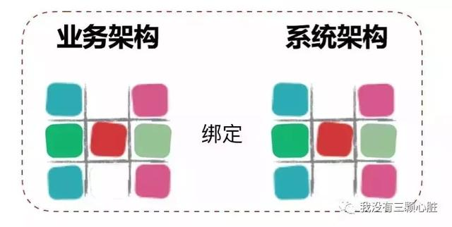
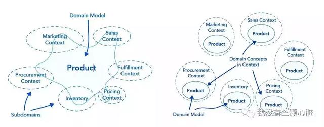
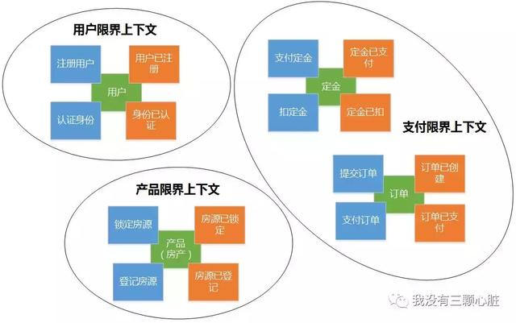
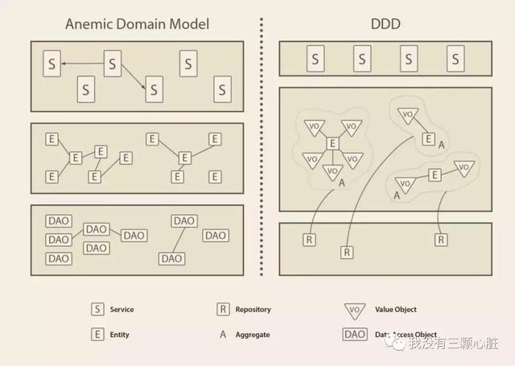
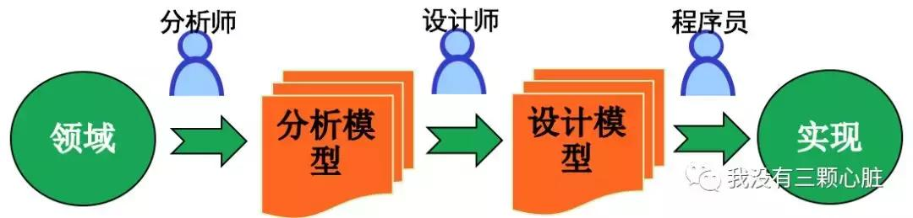
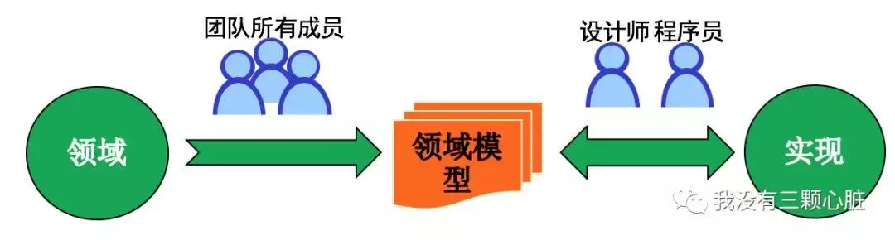
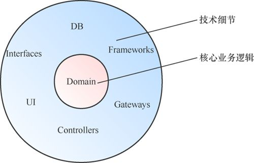

# DDD 
## 发展
```text
2004年著名建模专家Eric Evans发表了他最具影响力的书籍:
《Domain-Driven Design Tackling Complexity in the Heart of Software》
(中文译名：领域驱动设计软件核心复杂性应对之道)，书中提出了领域驱动设计(简称 DDD)的概念。
由于概念抽象，该设计思想并未和「敏捷」一样变得更加流行。

2013，微服务架构的风潮，由于「DDD」可以有效的从业务视角对软件系统进行拆解，并且「DDD」特别契合微服务的一个特征：围绕业务能力构建。
所以用「DDD」拆分出来的微服务是比较合理的而且能够实现高内聚低耦合，这样接着微服务「DDD」迎来了它的第二春。
```
## 技术背景
### 服务器后端发展三个阶段
```text
1. UI+DataBase的两层架构
	这种面向数据库的架构没有灵活性。
2. UI+Service+DataBase的多层SOA架构
	服务+表模型的架构易使服务变得囊肿，难于维护拓展，伸缩性能差。
3. DDD+SOA的事件驱动的CQRS读写分离架构
	应付复杂业务逻辑，以聚合模型替代数据表模型，以并发的事件驱动替代串联的消息驱动，
	真正实现以业务实体为核心的灵活拓展。
```
### 「CRUD」(「以数据为中心」的开发模式)有什么问题？
#### 面向对象和数据库天然阻抗
```text
（1）对象和关系数据库累赘转换；
（2）继承关系的尴尬实现；
	如：如果我们按照把 Student 和 Professor 建成两张表，问题就是：关系数据库分割了两个对象的共性 Person。
	从语义上说：也就是将一个对象分割成两个部分了；
	而且当你要获取这个对象时，需要两次Select，同样道理增删改查都要两次。
	而如果我们把 Student 和 Professor 合并成一张表，问题就是：会产生许多空白字段。
（3）类的复杂关系实现
	如 当我们需要创建一个部门（Department），而一个部门将拥有多个教授（Professor）这样一个模型的时候，
		我们发现面向对象和关系数据库「表达方式」的是两种不同的形式：
	面向对象：我是一个部门，在我里面有很多的教授；
	关系数据库，由于外键会在 Professor 上：我是一个教授，我属于那个部门。
 这些都反映了面向对象和关系数据库天然不匹配，只能一方作出妥协，并且大部分情况是面相对象作出妥协。
```
#### 是一种数据模型，与业务脱节
```text
关系型数据库（Relational Database）的核心实体就是数据表，核心操作就是在定义好的数据表上的「CRUD」操作。
这套东西实在是太好用了，也太深入人心了。

问题出在：
「Entity层」只是数据库表结构的一种映射用于承载数据，
「DAO层」只是封装了对「Entity层」的增删改查，
「Controller层」只是简单的把地址和对应「Service层」的对应方法做了关联返回结果给「视图层」，
「Service层」则大部分工作也只是在做一些「查询」、「拼接数据」的工作。

这样的系统是声称套上了业务的外衣，而实则只是「皇帝的新衣」，几乎无法保证业务逻辑的正确性、完整性。
```
#### CRUD 缺少意图（intent）
```text
当系统的「复杂度」上升的时候，「CRUD」可能会缺少一件事：意图（intent）。
例如：
我们想要改变一个 Customer 的地址，在「CRUD」体系中，我们只需要发出更新语句就能实现。
但是我们无法弄清楚这种变化是由不正确的操作引起的，还是客户真的转移到了另一个城市。
也许我们有一个业务场景，需要再重新定位时触发对外部系统的通知。在这种情况下，「CRUD」显得有所缺失。
```
#### 实施协作“困难”
```text
在大多数的「CRUD」应用中，最新的更改将覆盖其他用户并行执行的其他更改。
也就是说如果一个团队中的两个人同时对同一个文件的同一行进行修改，那么合并代码的时候就会产生「冲突」。

传统「CRUD」这样的矛盾是如何产生的：散落在各处分散的逻辑代码。
```
#### 被人诟病的「U」
```text
基于多种多样的「场景」,可能使你的通用「U」变得臃肿难以维护，我们的通用「U」方法被推向了尴尬的境地。

另外也有的人说「CRUD」限制了描述业务的语言的问题。
因为增删改查只有四个动词，而我们实际的业务场景可能更加复杂。
```
#### 提供变更历史记录的操作很复杂
```text
「CRUD」会丢失应用程序的历史记录。
例如，
如果用户在一段时间内多次变更记录，我们则无法再跟踪单个更改。更糟糕的是，甚至无法确定该条目是否曾经被改变过。
如果你对整个历史感兴趣，事情就会变得复杂：你必须从一开始就额外引入一组字段or一张新表。

这里的问题是：
由于你不知道将来会询问哪些关于你数据的问题，因此你无法针对相应的情况对表做出优化。
因为你收集太多或者太少的数据，似乎都存在一定问题。
```
#### 总结
理解并抽象出业务逻辑，建立满足需求的业务模型，以此设计实现出可靠的系统，并有效地控制复杂性。

## What？
```text
将要解决的业务概念和业务规则转换为软件系统中的类型以及类型的属性与行为，
通过合理运用面向对象的封装、继承、多态等设计要素，降低或隐藏整个系统的业务复杂性，
并使得系统具有更好的扩展性，应对纷繁多变的现实业务问题。
```
* DDD是面向对象的，是一种知识丰富的设计（Knowledge Rich Design）
```text
通过领域对象，领域语言将核心的领域概念通过代码的形式表达出来，从而增加代码的可理解性。
领域核心不仅仅是业务里的“名词”，所有的业务活动和规则如同实体一样，都需要明确的表达出来。
```
* Persistence Ignorance：持久化无关设计
```text
类和表的区别：
【引用】关系数据库表表示多对多的关系是第三张表来实现，这个领域模型表示不具象化，业务同学看不懂
【封装】类可以设计方法，数据并不能完整的表达领域模型，数据表可以知道一个人三维，并不知道“一个人是可以跑的”
【继承，多态】类可以多态，数据上无法识别人与猪除了三维数据还有行为的区别，数据表不知道“一个人跑起来和一头猪跑起来是不一样的”
```
```text
在这种思路下，数据库回归persistence的本质：
【存】将对象数据持久化到存储介质中
【取】高效的把数据查询返回到内存中
```
```text
由于不再承载领域建模这个特性，数据库的设计可以变得天马行空，任何可以加速存储和搜索的手段都可以用上，
我们可以用column数据库，可以用document数据库，可以设计非常精巧的中间表去完成大数据的查询。
```


## 目标
提供一种通用的语言，使得领域专家和软件技术人员联系在一起，沟通无歧义。

DDD的初衷：让业务架构绑定系统架构


后来发现这个方法不仅仅可以做好翻译，还可以帮助业务划分领域边界，
可以明确哪个领域是自己的核心价值所在，以后应该重点发展哪个领域。
甚至可以作为组织进行战略规划的参考。
而能够做到这点，其实背后的原因是物理世界和虚拟世界的融合。

* DDD带来的不同：
```text
将原有以技术角度审视架构演进的视角，转换到以业务视角切入架构。
业务复杂度来源于领域本身，深入领域，正确识别出领域深层次概念及关系。
将领域知识进行结构性表达，同时与编程模型保持一致，便形成了DDD。
```

## Why?
### DDD 帮助解决微服务拆分困境
所谓的微服务拆分困难，其实根本原因是不知道边界在什么地方。
而使用DDD对业务分析的时候，首先会使用「聚合」这个概念把关联性强的业务概念划分在一个边界下，
并限定「聚合」和「聚合」之间只能通过「聚合根」来访问，这是第一层边界。

然后在「聚合」基础之上根据「业务相关性」、「业务变化频率」、「组织结构」等等约束条件来定义「限界上下文」，这是第二层边界。
有了这两层边界作为约束和限制，微服务的边界也就清晰了，拆分微服务也就不再困难了。



### DDD 帮助应对系统复杂性
解决复杂和大规模软件的武器可以被粗略地归为三类：「抽象」、「分治」和「知识」。
```text
* 分治
	把问题空间分割为规模更小且易于处理的若干子问题。评判什么是分治得好，即高内聚低耦合。
* 抽象
	使用抽象能够精简问题空间，而且问题越小越容易理解。
* 知识
	顾名思义，「DDD」可以认为是知识的一种。
```
「DDD」提供了这样的知识手段，让我们知道如何抽象出「限界上下文」以及如何去「分治」。


另外一个感受就是我们可以使用「领域事件」来应对多样的变化。

更为重要的是，「DDD」架构区别于传统的方式。


相对于贫血模型，「DDD」则把大多数的业务逻辑都包含在了「聚合」、「实体」、「值对象」里面，
简单理解也就是实现了对象自治，把之前暴露出来的一些业务操作隐藏进了「域」之中。
每个不同的区域之间只能通过对外暴露的统一的聚合根来访问，这样就做了收权的操作，
这样数据的定义和更改的地方就聚集在了一处，很好的解决了复杂度的问题。

### DDD 帮助统一语言
在UML作为建模主流的时代，软件设计被明确分为面向对象分析（OOA），面向对象设计（OOD）和面向对象编码（OOP）阶段。
实际操作中OOD的工作往往被OOA和OOP各自承担一部分，并同时存在分析模型和设计模型两个割裂的模型。


领域驱动设计的核心是建立统一的领域模型。
领域模型在软件架构中处于核心地位，软件开发过程中，必须以建立领域模型为中心，以保障领域模型的忠实体现。


简单理解起来的话，也就是把业务人员和开发人员的语言统一起来，用代码来感受一下大概就是：
```java
userService.love(Jack, Rose) => Jack.love(Rose)
companyService.hire(company,employee) => Company.hire(employee)
```

## 优势
* 统一语言

* 面向对象
领域模型的设计精髓在于面向对象分析、对事物的抽象能力，一个领域驱动架构师必然是一个面向对象分析的大师。

* 业务语义显性化
统一语言使得我们的核心领域概念可以无损地在代码中呈现，从而提升代码的可理解性。
面向对象也是让代码尽量体现领域实体和实体之间的关系原貌，所以目的也是业务语义被显性化地表达，
	显性化的结果是代码更容易被理解和维护，殊途同归，一切都是为了控制复杂度。

* 分离业务逻辑和技术细节
数据库、UI和框架都是技术细节

技术细节和核心业务逻辑是两个维度的重要性，
如果把软件比喻成一个人，那么核心业务逻辑是大脑，技术细节是身体，二者都很重要，分开处理主要是为了降低复杂度。

DDD让我们有机会分离核心业务逻辑和技术细节，让两个维度的复杂度有机会被解开和分治。
核心业务逻辑对技术细节没有任何依赖，依赖都是由外向内的，即使有由内向外的依赖，也应该通过依赖倒置来反转依赖的方向。
通过这样的划分，Entities只要安安心心地处理业务逻辑就好，业务逻辑越复杂，这样划分带来的好处越明显。


## DDD不是银弹
* 哪些产品适用于DDD：
```text
复杂问题，或者子域内具有复杂性
业务是否重要且有很高的预期
是否可以让运营和PM介入
遵循迭代式的开放方法
```
## 领域模型好坏的标准：
```text
模型反映了对于问题的抽象，抽象没有统一的标准
模型是迭代演进的，需要持续集成，改进
通用语言，领域模型和代码目标意图一致
```

## Reference
[什么是领域驱动设计？DDD？](https://www.toutiao.com/i6702660118804169229/)
